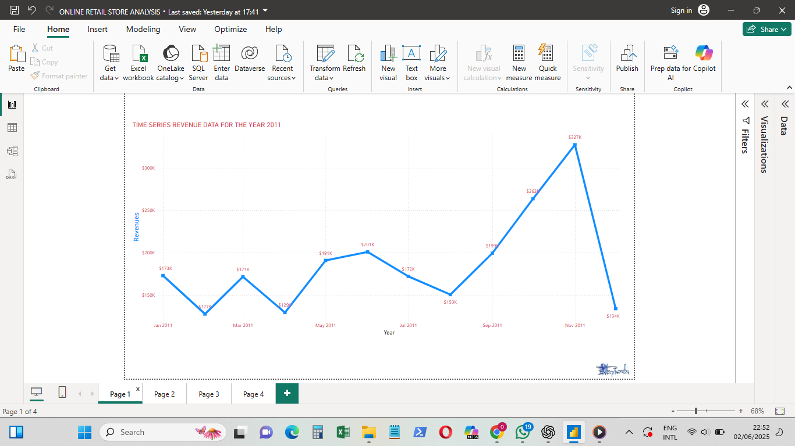
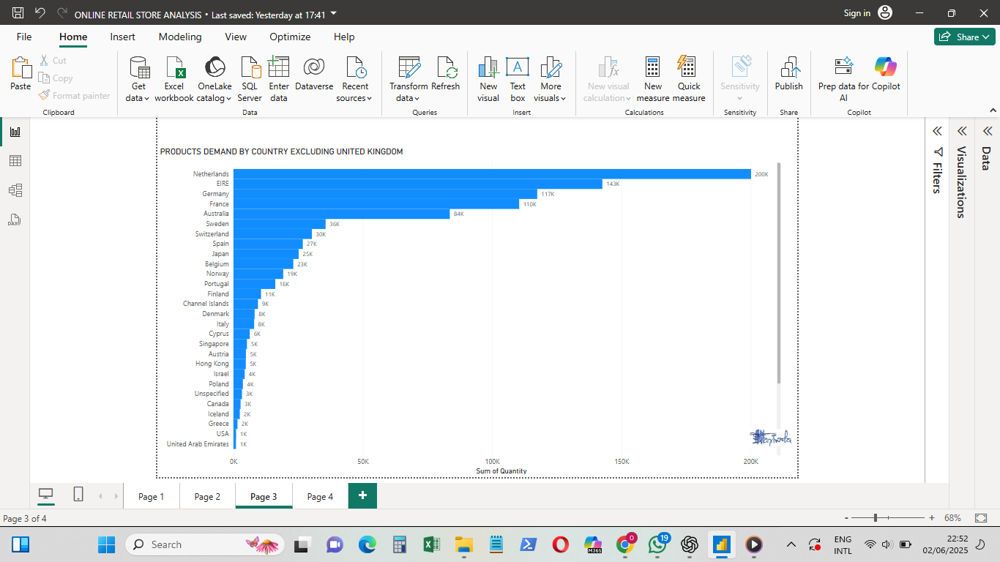
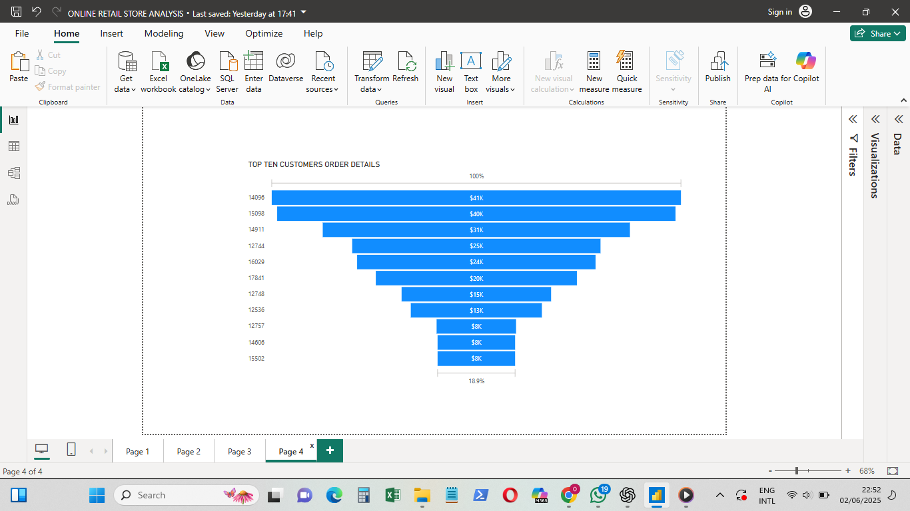
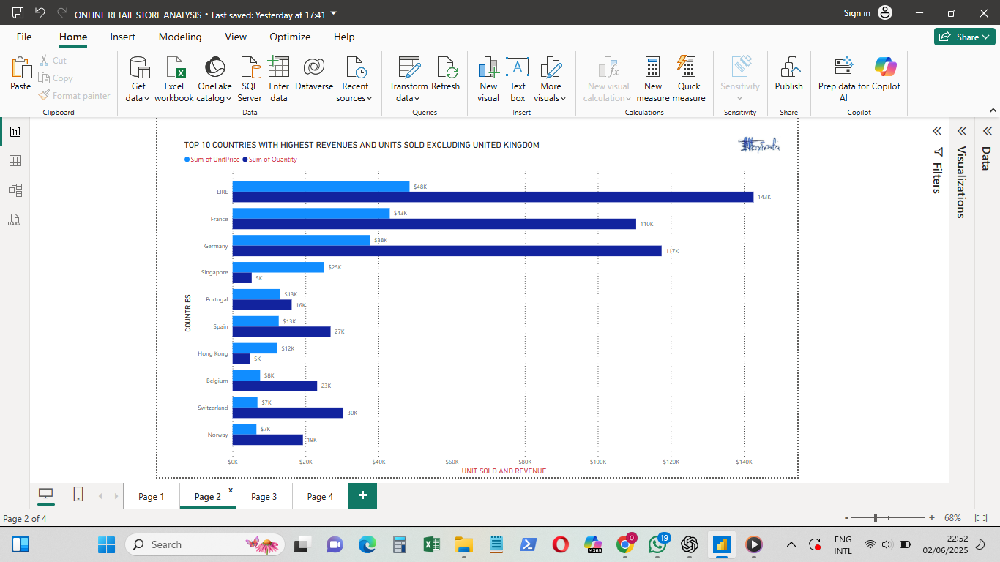

# 🛒 Online Retail Sales Analysis - 2011

This project explores detailed sales data from 2011 to uncover insights into revenue trends, customer behavior, and product demand. The analysis was performed using Excel and visualized using charts and dashboards.

---

## 📊 Key Business Questions Answered

### 1. 📆 Monthly Revenue for 2011
- How much revenue was generated each month in 2011?
- What seasonal trends can be identified?

### 2. 🌍 Product Demand by Country
- Which countries (excluding the United Kingdom) show the highest quantity sold?
- Where is there high potential for market expansion?

### 3. 🏆 Top 10 Customers by Revenue
- Who are the top revenue-generating customers?
- How much did each contribute?
- How can we target and retain these key customers?

### 4. 🌐 Top 10 Countries by Revenue (Excluding UK)
- What countries generated the most revenue outside of the UK?
- How does quantity sold compare across these countries?

- 🖼️ Visualizations
The following visuals answer key business questions from the 2011 online retail sales data:

